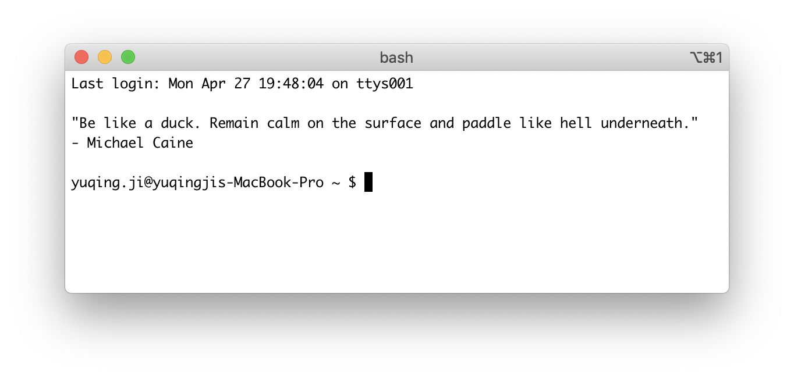

COVID-19, recession, ...my daily life has been changing a lot in 2020:
- always worry about the health of the people around me and myself.
- WFH for almost 2 months. It will keep going because of the recession. 
- food price keeps rising like nothing happened. 

I feel okay since things can't be made worse - either get better or nothing is going to change, but sometimes stress because of the uncertainty in practice.

Recently I found reading kind of helpful on the stress so I wrote [gooday](https://github.com/vjyq/gooday). 
As a programmer, terminal might be the target I talk to most in a day. 
With gooday, when I new a tab/window in the terminal, a wording will pop up first. 
Reading that, I would say, is just like sharing feelings with a friend. 



gooday includes 2 parts:
1. `gd.py` generates a wording which is dumped from remote (TBC) or loaded from local. 
2. `install.sh` makes you see it - by updating `bash_profile`.

2 setup steps (see [README](https://github.com/vjyq/gooday) for details):
1. clone the repo
2. bash execute `install.sh`

My OS:
```
yuqing.ji@yuqingjis-MacBook-Pro ~ $ sw_vers
ProductName:	Mac OS X
ProductVersion:	10.14.4
BuildVersion:	18E226
```

Wish gooday also could be helpful to you. Have a good day.

<div style="border-top:1px solid #e1e4e8;padding-top:16px"></div>
<div>© 2018-2020 by YUQING JI</div>
<div style="padding-top:0.3em"><a href="https://vjyq.github.io/vjyq.github.io/en/">Blog</a> | <a href="mailto:yuqing.ji@outlook.com">Email</a> | <a href="https://github.com/vjyq">Github</a></div>