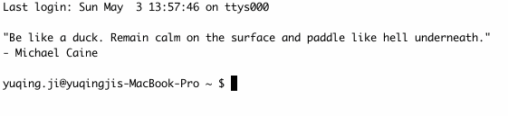

COVID19, recession, ...my daily life has been changing a lot in 2020:
- always worry about the health of the people around me and myself.
- WFH for almost 2 months. It will keep going because of the recession. 
- food price keeps rising like nothing happened. 

I feel okay since things can't be worse - either get better or nothing is going to change, but sometimes anxious because of the uncertainty in practice.

Recently I found reading kind of smoothed me. So, I wrote [gooday](https://github.com/gniquyij/gooday). 
As a programmer, terminal might be the target I talk to most in a day. 
With gooday, when I new a tab/window in the terminal, a wording will pop up, 
which is like a sharing from a friend.

gooday basically includes 2 parts:
1. `gd.py` generates a wording which is dumped from remote (TBC) or loaded from local. 
2. `install.sh` makes you see it - by updating `bash_profile`.

2 setup steps (see [README](https://github.com/gniquyij/gooday) for details):
1. clone the repo
2. bash execute `install.sh`

I also made a PRO mode, which would require users to guess the word in the sentence. 
As you might have guessed, to use your terminal, you need to first finish it. 

You might succeed

or fail

Doesn't matter ;)

Wish gooday also could be helpful to you. Have a good day.

© 2018-2020 by YUQING JI

<a href="https://gniquyij.github.io/en/about">About</a> | <a href="https://gniquyij.github.io/">Blog</a> | <a href="mailto:yuqing.ji@outlook.com">Email</a> | <a href="https://github.com/gniquyij">Github</a> | <a href="https://gniquyij.github.io/zh">中文</a>
